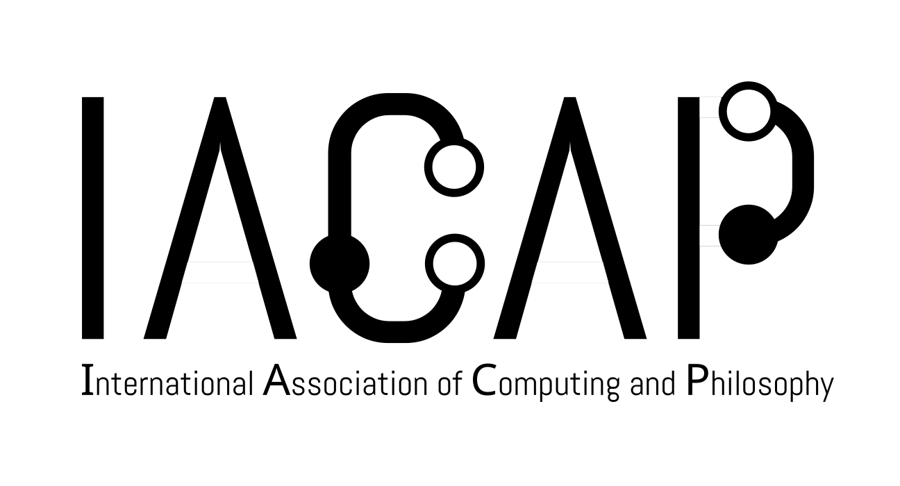

 

# Joint IACAP/AISB Conference on Philosophy of Computing and AI (IACAP/AISB-25)

### 1-3 July 2025, University of Twente, NL

The [International Association for Computing and Philosophy](https://iacap.org) (IACAP) and the [Society for the Study of Artificial Intelligence and Simulation of Behaviour](https://aisb.org.uk/) (AISB) will host a joint conference from 1-3 July, 2025 at the University of Twente, NL. Submissions and registration are closed. Programme and abstracts are available [here](/pages/schedule.md), symposia proceedings [here](https://aisb.org.uk/wp-content/uploads/2025/06/AISB-IACAP-Convention2025.pdf).

### 30 June 2025, 4TU.ethics Workshop 

On 30 June a 4TU.ethics workshop on AI and neurotechnology will be held at the University of Twente, NL. This workshop, organised in conjunction with member societies IACAP and AISB, also comprises the formal opening of the joint IACAP-AISB conference, which takes place at UT From 1 to 3 July 2025. The workshp schedule can be found [here](pages/4tu).
 
This highly interdisciplinary workshop is free for members of 4TU.ethics and those who are registered to attend the conference. The workshop is followed by a reception that doubles as a 4TU.ethics social event, but you should register for this separately if you intend to join. The workshop is planned in association with [special issue on NeuroAI](https://www.elspublishing.com/journals/law-ethics-technology/special_issues/ai-enabled-neurotechnologies).

## Keynote Speakers

* AISB Keynote - [Philip Brey](https://people.utwente.nl/p.a.e.brey)
* IACAP Covey Award Address – [Vincent C. Müller](https://www.iacap.org/2025/03/29/2025-covey-award-winner-vincent-c-muller/)
* IACAP Simon Award Address – [Emily E. Sullivan](https://www.iacap.org/2025/04/07/2025-simon-award-winner-emily-sullivan/)

## Important Information

* **Conference dates**: July 1-3
* **Conference website**: [iacapconf.org/](https://iacapconf.org/)
* **Conference proceedings (from symposia)**: [pdf from AISB website](https://aisb.org.uk/wp-content/uploads/2025/06/AISB-IACAP-Convention2025.pdf)
* **[Conference registration (now closed)](https://2025.tickets.iacapconf.org/)**
* **Code of Conduct**: [view here](pages/code_of_conduct)
* **Host Organisation Websites**:
  * [IACAP.org](https://iacap.org)
  * [AISB.org.uk](https://aisb.org.uk/)
* **Conference location**: Enschede, NL.
* **Conference host**: University of Twente
* **[Call for Abstracts (now closed)](https://pretalx.iacapconf.org/iacap-2025/cfp)**
* **Useful Resources:**
  * [Practical Information](pages/practical)
  * [Schedule](pages/schedule)

## IACAP-AISB-2025 Organising Committee [OC]
 
* Y. J. Erden (University of Twente)
* Stephen Rainey (TU Delft) 
* Rob Wortham (University of Bath)
* Arzu Formanek (Fraunhofer Institute)
* Björn Lundgren (University of Erlangen)
* Hajo Greif (Warsaw University of Technology)

Questions about the conference to: [Y. J. Erden](mailto:y.j.erden@utwente.nl) and [Stephen Rainey](mailto:S.Rainey@tudelft.nl) 

General questions about symposia to: [Y. J. Erden](mailto:y.j.erden@utwente.nl) and [Stephen Rainey](mailto:S.Rainey@tudelft.nl)

Questions about symposium interna to the respective symposium organisers.

Questions about non-symposia presentations, posters and registration technicalities: [Arzu Fomanek, Björn Lundgren, Hajo Greif, Brian Ballsun-Stanton](mailto:iacap@ballsun.com) 

## Call for Proposals (archive) 

You will find the call for proposals [here](https://iacapconf.org/pages/cfp)

## Join the Community

For updates on IACAP conferences and to be part of the conversation with other attendees, you can join:

* Our [Slack channel here](https://join.slack.com/t/iacapworkspace/shared_invite/zt-1qjs05kaa-BecKu_EZnBrPLUky0XV9xg)
* Our [Mailing List here](https://listi.jpberlin.de/mailman/listinfo/iacap-announce) (no book or paper announcements)

## Past conferences

* See links to our [past conferences](pages/past_conferences.md)